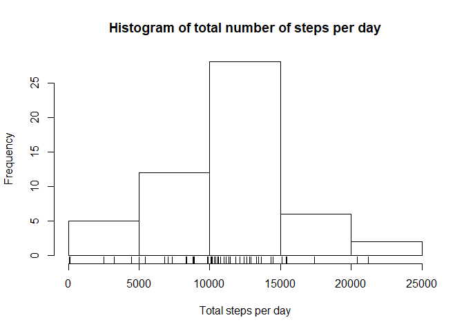

```r
library(readr)
library(dplyr)
```

```
## 
## Attaching package: 'dplyr'
```

```
## The following objects are masked from 'package:stats':
## 
##     filter, lag
```

```
## The following objects are masked from 'package:base':
## 
##     intersect, setdiff, setequal, union
```

```r
library(ggplot2)
```

Dataset for this project can be found in here "activity/activity.csv"

```r
unzip("activity.zip")
activity_df <- read_csv("activity.csv")
```

```
## Parsed with column specification:
## cols(
##   steps = col_double(),
##   date = col_date(format = ""),
##   interval = col_double()
## )
```

## Questions 1: What is mean total number of steps taken per day?  
a. Make a histogram of the total number of steps taken each day  

```r
solution1a_df <- filter(activity_df, !is.na(steps)) %>%
  group_by(date) %>%
  summarise(total.steps = sum(steps))

hist(solution1a_df$total.steps,
     main = "Histogram of total number of steps per day", 
     xlab = "Total steps per day")
rug(solution1a_df$total.steps)
```

<!-- -->

```r
#creating directory for saving figure file
dir.create(path = "figure")

## Copy my plot to a PNG file of width = 672px, height = 480px
dev.copy(png, file = "figure/plot1.png", width = 672, height = 480, units = "px" )
```

```
## png 
##   3
```

```r
## closing the PNG device!
dev.off()
```

```
## png 
##   2
```

b. Calculate and report the mean and median total number of steps taken per day  

```r
mean_day_steps <- mean(solution1a_df$total.steps)
median_day_steps <- median(solution1a_df$total.steps)
```
The mean number of total daily steps = 1.0766189\times 10^{4}  
The median number of total daily steps = 1.0765\times 10^{4}  


## Question 2: What is the average daily activity pattern?  
a. Make a time series plot (i.e. type = "l") of the 5-minute interval (x-axis) and the average number of steps taken, averaged across all days (y-axis)  


```r
solution2a_df <- activity_df %>%
  group_by(interval) %>%
  summarise(avg.steps = mean(steps, na.rm = TRUE))

with(solution2a_df, plot(x = interval, y = avg.steps, type = "l", 
                     main = "Time series plot of the  interval and the average steps taken", 
                     xlab = "Interval", 
                     ylab = "Average steps"))
```

<!-- -->

```r
## Copy my plot to a PNG file of width = 672px, height = 480px
dev.copy(png, file = "figure/plot2.png", width = 672, height = 480, units = "px" )
```

```
## png 
##   3
```

```r
## closing the PNG device!
dev.off()
```

```
## png 
##   2
```

b. Which 5-minute interval, on average across all the days in the dataset, contains the maximum number of steps?  


```r
filter(solution2a_df, 
       avg.steps == max(solution2a_df$avg.steps))
```

```
## # A tibble: 1 x 2
##   interval avg.steps
##      <dbl>     <dbl>
## 1      835      206.
```

## Question 3: Imputing missing values
a. Calculate and report the total number of missing values in the dataset
(i.e. the total number of rows with NAs)  


```r
#This is the total number of rows with incomplete values
sum(!complete.cases(activity_df))
```

```
## [1] 2304
```
b. Devise a strategy for filling in all of the missing values in the dataset. The
strategy does not need to be sophisticated. For example, you could use
the mean/median for that day, or the mean for that 5-minute interval, etc.  

```r
summary(activity_df)
```

```
##      steps             date               interval     
##  Min.   :  0.00   Min.   :2012-10-01   Min.   :   0.0  
##  1st Qu.:  0.00   1st Qu.:2012-10-16   1st Qu.: 588.8  
##  Median :  0.00   Median :2012-10-31   Median :1177.5  
##  Mean   : 37.38   Mean   :2012-10-31   Mean   :1177.5  
##  3rd Qu.: 12.00   3rd Qu.:2012-11-15   3rd Qu.:1766.2  
##  Max.   :806.00   Max.   :2012-11-30   Max.   :2355.0  
##  NA's   :2304
```
From the output above you see that missing values only exist for the the `step` variable `(NA's   :2304)`.  

### Steps for filling in all of the missing values in the dataset:
`The idea is to use the mean for that 5-minute interval`, because using the mean/median for
the day `date` still produces `NA/NaN` and median for that 5-minute `interval` produces lots of zeros.  

**Stratagy for filling missing values using the mean for that interval:**  
1. Group the dataset by the interval variable and summarise the mean(steps, na.rm = TRUE) call it `no_NA_df`.  
2. Inner-join no_NA_df and activity_df by their interval column call it `no_NA_df`.  
3. Loop through the `no_NA_df`, assigning the value of `no_NA_df$interval.mean.steps` anywhere `no_NA_df$steps` is `NA`.  


c. Create a new dataset that is equal to the original dataset but with the
missing data filled in.  

```r
no_NA_df <- activity_df %>%
  group_by(interval) %>%
  summarise(interval.mean.steps = mean(steps, na.rm = TRUE))

no_NA_df <- inner_join(x = activity_df, y =  no_NA_df, by = "interval")

for (i in 1:nrow(no_NA_df)) {
  if(is.na(no_NA_df$steps[i])){
    no_NA_df$steps[i] <- no_NA_df$interval.mean.steps[i]
  }else
    next
}
```


d. Make a histogram of the total number of steps taken each day and Calculate and report the mean and median total number of steps taken per day. Do these values differ from the estimates from the first part of the assignment?  
What is the impact of imputing missing data on the estimates of the total daily number of steps?  


```r
#using the `no_NA_df` dataset

day_total_steps_df <- no_NA_df %>%
  group_by(date) %>%
  summarise(total.steps = sum(steps))

hist(day_total_steps_df$total.steps,
       main = "Histogram of total number of steps per day", 
       xlab = "Total steps per day")
rug(day_total_steps_df$total.steps)
```

<!-- -->

```r
## Copy my plot to a PNG file of width = 672px, height = 480px
dev.copy(png, file = "figure/plot3.png", width = 672, height = 480, units = "px" )
```

```
## png 
##   3
```

```r
## closing the PNG device!
dev.off()
```

```
## png 
##   2
```


```r
mean_day_steps_noNA <- mean(day_total_steps_df$total.steps)
median_day_steps_noNA <- median(day_total_steps_df$total.steps)
```
Former mean number of total daily steps = 1.0766189\times 10^{4}  
Former median number of total daily steps = 1.0765\times 10^{4}

Current mean number of total daily steps = 1.0766189\times 10^{4}  
Current median number of total daily steps = 1.0766189\times 10^{4}  

**Do these values differ from the estimates from the first part of the assignment?** Yes.  
Their mean are the same but median differ by 1.1886792 total steps.  


## Question 4: Are there differences in activity patterns between weekdays and weekends?

a. Create a new factor variable in the dataset with two levels -- "weekday" and "weekend" indicating whether a given date is a weekday or weekend day.


```r
#using the dataset with the filled-in missing values
solution4a_df <- no_NA_df %>%
  mutate(day.type = if_else((weekdays(date) == "Sunday") | (weekdays(date) == "Saturday"), 
                            true = "weekend", false = "weekday")) %>%
  mutate(day.type = as.factor(day.type))
```

b. Make a panel plot containing a time series plot (i.e. type = "l") of the 5-minute interval (x-axis) and the average number of steps taken, averaged across all weekday days or weekend days (y-axis).


```r
solution4b_df <- group_by(solution4a_df, day.type, interval) %>%
  summarise(avg.steps = mean(steps))

#plotting
g <-ggplot(data = solution4b_df, aes(x = interval, y = avg.steps))

#modifing aesthetics
g <- g + facet_wrap(. ~ day.type, ncol = 1) + geom_line()

#modifying labels
g + labs(title = "Plot of 5-minute interval and average step") +
  labs(subtitle = "Averaged across all weekday days or weekend days") +
  labs(x = "Interval") +
  labs(y = "Number of steps")
```

<!-- -->

```r
## Copy my plot to a PNG file of width = 672px, height = 480px
dev.copy(png, file = "figure/plot4.png", width = 672, height = 480, units = "px" )
```

```
## png 
##   3
```

```r
## closing the PNG device!
dev.off()
```

```
## png 
##   2
```

